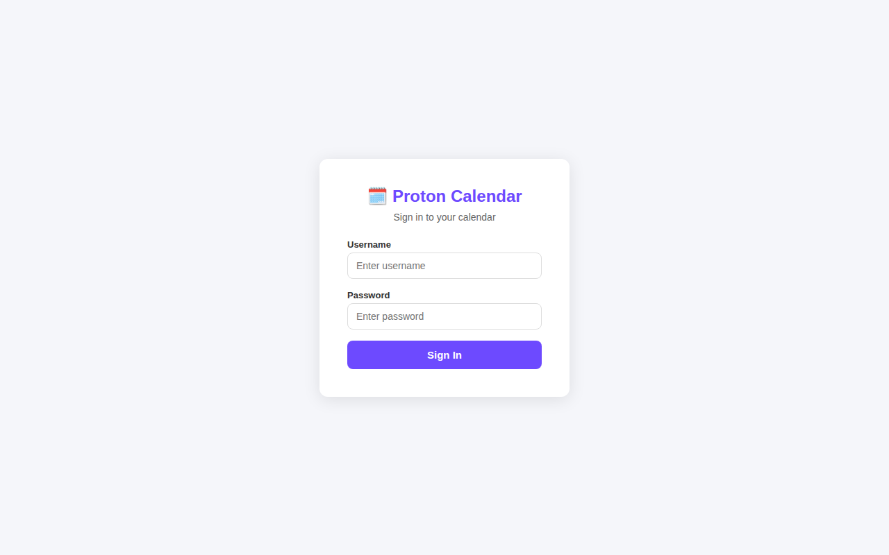
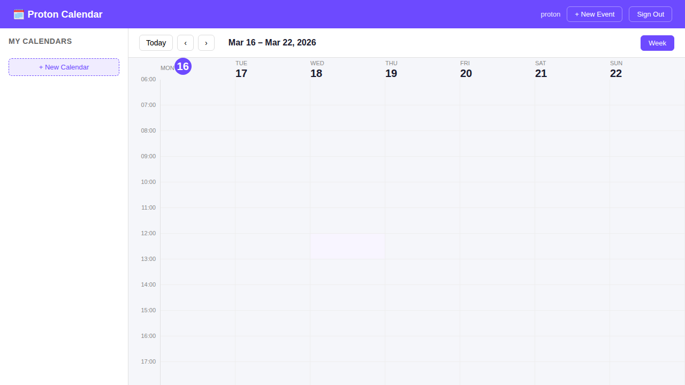
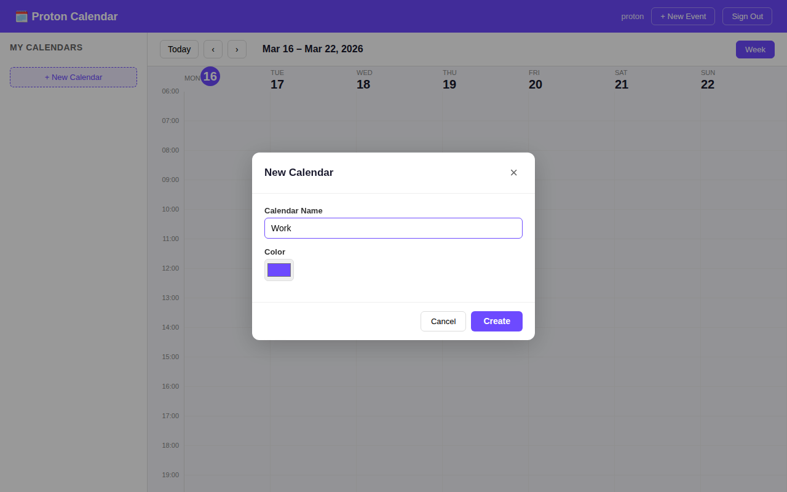
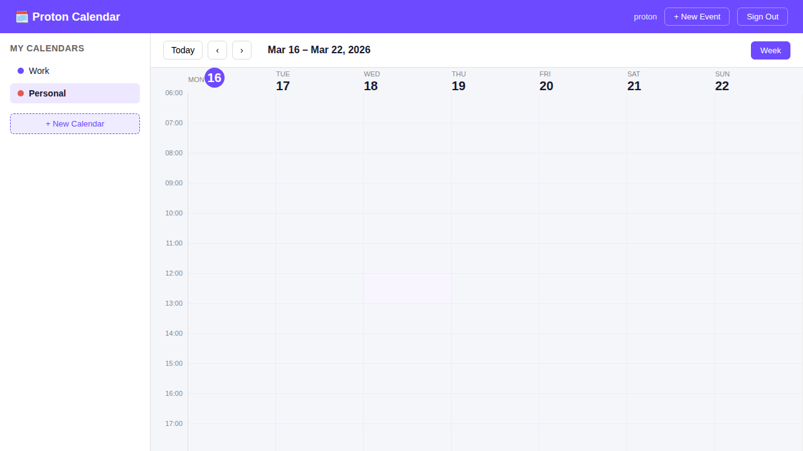
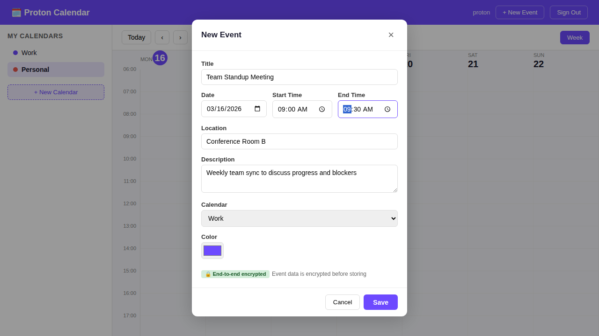
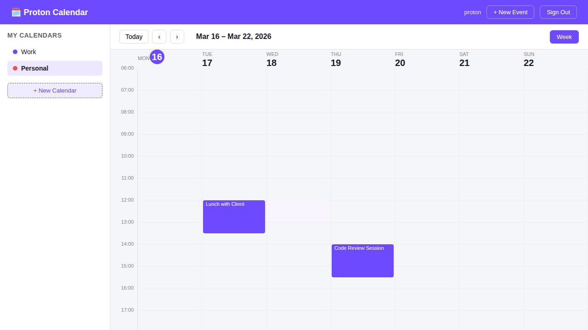
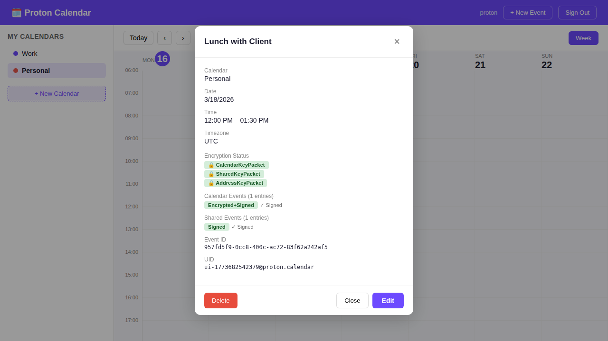
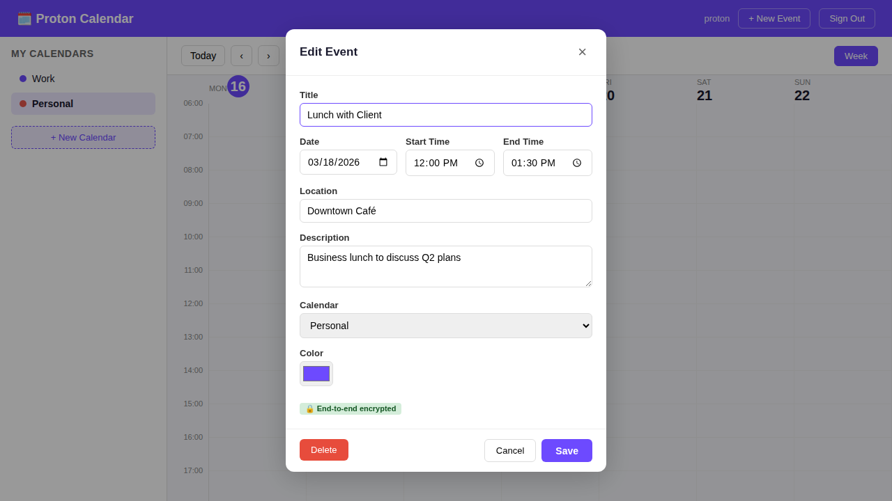

# Proton Calendar

A self-hosted calendar application consisting of a **Go backend API** (with SQLite storage), the **Proton Calendar web frontend**, and the **Proton Calendar Android app**.

## Repository Structure

```
├── backend/              # Go REST API (SQLite, authentication, CRUD)
│   ├── auth/             # Token-based authentication
│   ├── handlers/         # HTTP request handlers
│   ├── models/           # Data models
│   ├── router/           # URL routing
│   ├── store/            # SQLite database layer
│   ├── static/           # Browser-based test page & calendar UI
│   ├── k8s/              # Kubernetes manifests
│   ├── Dockerfile        # Container image build
│   └── main.go           # Entry point
├── mobile/               # Mobile applications
│   └── android-calendar/ # Proton Calendar Android app (git submodule)
├── applications/
│   └── calendar/         # Proton Calendar web frontend (React)
├── e2e/                  # End-to-end Playwright tests
└── packages/             # Shared frontend packages
```

---

## Screenshots

The built-in calendar web UI (`/static/calendar.html`) provides a full-featured interface for managing calendars and events. All event data is end-to-end encrypted.

### Login



### Calendar Overview

After login, the week view shows your calendars in the sidebar and events on the time grid.



### Creating a Calendar

Click **+ New Calendar** to open the creation dialog. Choose a name and color.



After creating calendars, they appear in the sidebar:



### Creating an Event

Click **+ New Event** to open the event form. Fill in title, date, time, location, description, and select a calendar. Events are encrypted before storing.



### Week View with Events

Events appear as colored blocks on the weekly time grid:



### Event Details

Click any event to view its full details, including encryption status (CalendarKeyPacket, SharedKeyPacket, AddressKeyPacket) and encrypted data entries:



### Editing Events

Click **Edit** from the detail view to modify an existing event:



---

## Backend API

The backend is a standalone Go HTTP server that provides a REST API compatible with the Proton Calendar frontend. Data is stored in a SQLite database.

### Quick Start (Local)

```bash
cd backend
go build -o calendar-api .
./calendar-api -addr :8080 -db calendar.db
```

The server starts on `http://localhost:8080` with default credentials:

| Field    | Value    |
|----------|----------|
| Username | `proton` |
| Password | `proton` |

### Command-Line Flags

| Flag    | Default        | Description                |
|---------|----------------|----------------------------|
| `-addr` | `:8080`        | Listen address (host:port) |
| `-db`   | `calendar.db`  | Path to SQLite database    |

---

## Authentication

The API uses Bearer token authentication. All endpoints (except login and token refresh) require a valid `Authorization` header.

### How to Log In

**1. Obtain an access token:**

```bash
curl -s -X POST http://localhost:8080/core/v4/auth \
  -H "Content-Type: application/json" \
  -d '{"Username": "proton", "Password": "proton"}'
```

Response:

```json
{
  "Code": 1000,
  "UID": "abc123...",
  "AccessToken": "your-access-token",
  "RefreshToken": "your-refresh-token",
  "ExpiresIn": 86400,
  "TokenType": "Bearer",
  "Scope": "full",
  "UserID": "user-1"
}
```

**2. Use the token in subsequent requests:**

```bash
curl -s http://localhost:8080/calendar/v1 \
  -H "Authorization: Bearer your-access-token"
```

**3. Refresh a token (before it expires):**

```bash
curl -s -X POST http://localhost:8080/auth/refresh \
  -H "Content-Type: application/json" \
  -d '{"UID": "abc123...", "RefreshToken": "your-refresh-token"}'
```

**4. Log out (invalidate session):**

```bash
curl -s -X DELETE http://localhost:8080/core/v4/auth \
  -H "Authorization: Bearer your-access-token" \
  -H "x-pm-uid: abc123..."
```

### Session Details

- Tokens expire after **24 hours**
- Each login creates a new independent session
- Refresh issues new access + refresh tokens and extends the session
- The `x-pm-uid` header is required for logout

---

## API Endpoints

### Authentication

| Method   | Path              | Description         |
|----------|-------------------|---------------------|
| `POST`   | `/core/v4/auth`   | Login               |
| `DELETE`  | `/core/v4/auth`   | Logout              |
| `POST`   | `/auth/refresh`   | Refresh tokens      |

### Calendars

| Method   | Path                              | Description              |
|----------|-----------------------------------|--------------------------|
| `GET`    | `/calendar/v1`                    | List all calendars       |
| `POST`   | `/calendar/v1`                    | Create a calendar        |
| `GET`    | `/calendar/v1/{calendarID}`       | Get a calendar           |
| `PUT`    | `/calendar/v1/{calendarID}`       | Update a calendar        |
| `DELETE`  | `/calendar/v1/{calendarID}`       | Delete a calendar        |

### Events

| Method   | Path                                                 | Description                         |
|----------|------------------------------------------------------|-------------------------------------|
| `GET`    | `/calendar/v1/{calendarID}/events?Start=&End=`       | List events in time range           |
| `GET`    | `/calendar/v1/{calendarID}/events/count`             | Count events                        |
| `GET`    | `/calendar/v1/{calendarID}/events/ids?Limit=&AfterID=` | Get event IDs (paginated)        |
| `GET`    | `/calendar/v1/{calendarID}/events/{eventID}`         | Get a specific event                |
| `DELETE`  | `/calendar/v1/{calendarID}/events/{eventID}`         | Delete an event                     |
| `PUT`    | `/calendar/v1/{calendarID}/events/sync`              | Bulk create/update/delete events    |
| `PUT`    | `/calendar/v1/{calendarID}/events/{eventID}/personal`| Update personal event data          |
| `GET`    | `/calendar/v1/events?UID=`                           | Find event by UID                   |

### Attendees

| Method   | Path                                                                  | Description           |
|----------|-----------------------------------------------------------------------|-----------------------|
| `GET`    | `/calendar/v1/{calendarID}/events/{eventID}/attendees`                | List attendees        |
| `PUT`    | `/calendar/v1/{calendarID}/events/{eventID}/attendees/{attendeeID}`   | Update attendee       |

### Calendar Settings

| Method   | Path                                    | Description                    |
|----------|-----------------------------------------|--------------------------------|
| `GET`    | `/calendar/v1/{calendarID}/settings`    | Get per-calendar settings      |
| `PUT`    | `/calendar/v1/{calendarID}/settings`    | Update per-calendar settings   |
| `GET`    | `/settings/calendar`                    | Get user-level settings        |
| `PUT`    | `/settings/calendar`                    | Update user-level settings     |

### Alarms

| Method   | Path                                           | Description              |
|----------|-------------------------------------------------|--------------------------|
| `GET`    | `/calendar/v1/{calendarID}/alarms?Start=&End=` | List alarms in range     |
| `GET`    | `/calendar/v1/{calendarID}/alarms/{alarmID}`   | Get a specific alarm     |

### Members

| Method   | Path                                              | Description         |
|----------|---------------------------------------------------|---------------------|
| `GET`    | `/calendar/v1/{calendarID}/members`               | List members        |
| `POST`   | `/calendar/v1/{calendarID}/members`               | Add a member        |
| `PUT`    | `/calendar/v1/{calendarID}/members/{memberID}`    | Update a member     |
| `DELETE`  | `/calendar/v1/{calendarID}/members/{memberID}`    | Remove a member     |

### Reference Data

| Method   | Path                        | Description                |
|----------|-----------------------------|----------------------------|
| `GET`    | `/calendar/v1/timezones`    | List IANA timezones        |
| `GET`    | `/calendar/v1/directory`    | Calendar directory (empty) |

---

## Mobile App (Android)

The official [Proton Calendar Android app](https://github.com/ProtonMail/android-calendar) is included as a **git submodule** at `mobile/android-calendar/`. This allows automatic syncing with upstream releases.

### Quick Setup

```bash
# Clone with submodules
git clone --recurse-submodules https://github.com/codecrafter404/Proton-WebClients.git

# Or initialize submodules after clone
git submodule update --init --recursive
```

### Configuring the Dev Server Address

Create `mobile/android-calendar/local.properties`:

```properties
# Android emulator → host machine backend:
HOST=10.0.2.2:8080

# Physical device on same WiFi:
# HOST=192.168.1.100:8080

# Remote server:
# HOST=calendar.example.com

sdk.dir=/path/to/Android/Sdk
```

Then build with the **devDebug** variant in Android Studio, or via CLI:

```bash
cd mobile/android-calendar
chmod +x gradlew
./gradlew assembleDevDebug
```

### CI/CD (GitHub Actions)

The workflow at `.github/workflows/mobile.yml` builds the APK with a configurable backend URL:

1. Go to **Actions** → **Mobile Android Build** → **Run workflow**
2. Set `backend_url` to your server (default: `10.0.2.2:8080` for emulator)
3. Select `build_variant` (devDebug, devRelease, prodDebug, prodRelease)
4. Download the APK from the workflow artifacts

### Syncing with Upstream

```bash
cd mobile/android-calendar
git fetch origin
git checkout origin/release/2.29.0-332  # latest release branch
cd ../..
git add mobile/android-calendar
git commit -m "Update android-calendar to latest release"
```

For full details, see [mobile/README.md](mobile/README.md).

## Mobile API Setup

The same REST API that powers the web frontend can be used by mobile applications. There is no separate "mobile API" — use the endpoints documented above.

### Connecting a Mobile App

1. **Base URL:** Point your mobile HTTP client at the backend server, e.g. `https://calendar-api.example.com` (or `http://localhost:8080` for local development).

2. **Authentication flow (same as web):**
   ```
   POST /core/v4/auth  →  { "Username": "proton", "Password": "proton" }
   ```
   Store the returned `AccessToken`, `RefreshToken`, and `UID`.

3. **Include auth headers on every request:**
   ```
   Authorization: Bearer <AccessToken>
   ```

4. **Token refresh:** Before `ExpiresIn` seconds elapse, call:
   ```
   POST /auth/refresh  →  { "UID": "<uid>", "RefreshToken": "<token>" }
   ```

5. **CORS:** The backend allows all origins, so mobile WebView-based apps work without extra configuration. Native HTTP clients are unaffected by CORS.

### Example: Create a Calendar Event from Mobile

```bash
# 1. Login
TOKEN=$(curl -s -X POST https://calendar-api.example.com/core/v4/auth \
  -H "Content-Type: application/json" \
  -d '{"Username":"proton","Password":"proton"}' | jq -r '.AccessToken')

# 2. List calendars to get a calendar ID
CAL_ID=$(curl -s https://calendar-api.example.com/calendar/v1 \
  -H "Authorization: Bearer $TOKEN" | jq -r '.Calendars[0].Calendar.ID')

# 3. Create an event via sync endpoint
curl -s -X PUT "https://calendar-api.example.com/calendar/v1/$CAL_ID/events/sync" \
  -H "Authorization: Bearer $TOKEN" \
  -H "Content-Type: application/json" \
  -d '{
    "MemberID": "member-1",
    "Events": [{
      "Overwrite": 1,
      "Event": {
        "Permissions": 3,
        "IsOrganizer": 1,
        "StartTime": 1700000000,
        "StartTimezone": "Europe/Berlin",
        "EndTime": 1700003600,
        "EndTimezone": "Europe/Berlin",
        "FullDay": 0,
        "UID": "mobile-event-001",
        "SharedEvents": [{"Type": 2, "Data": "BEGIN:VEVENT\nSUMMARY:Mobile Meeting\nEND:VEVENT"}],
        "Notifications": [{"Type": 0, "Trigger": "-PT15M"}]
      }
    }]
  }'
```

---

## Kubernetes Deployment

### Prerequisites

- A Kubernetes cluster (v1.24+)
- `kubectl` configured to access the cluster
- An ingress controller (e.g. NGINX Ingress Controller)
- Docker or a container registry

### 1. Build and Push the Docker Image

```bash
cd backend

# Build the image
docker build -t proton-calendar-api:latest .

# Tag for your registry
docker tag proton-calendar-api:latest your-registry.example.com/proton-calendar-api:latest

# Push to registry
docker push your-registry.example.com/proton-calendar-api:latest
```

### 2. Update the Deployment Image

Edit `backend/k8s/deployment.yaml` and replace the `image` field:

```yaml
image: your-registry.example.com/proton-calendar-api:latest
```

### 3. Update the Ingress Host

Edit `backend/k8s/ingress.yaml` and replace:

```yaml
host: calendar-api.example.com
```

with your actual domain.

### 4. Apply the Manifests

```bash
kubectl apply -f backend/k8s/namespace.yaml
kubectl apply -f backend/k8s/pvc.yaml
kubectl apply -f backend/k8s/deployment.yaml
kubectl apply -f backend/k8s/service.yaml
kubectl apply -f backend/k8s/ingress.yaml
```

### 5. Verify the Deployment

```bash
# Check pod status
kubectl -n proton-calendar get pods

# Check service
kubectl -n proton-calendar get svc

# Check ingress
kubectl -n proton-calendar get ingress

# View logs
kubectl -n proton-calendar logs -l app.kubernetes.io/name=proton-calendar

# Test the API (port-forward for local access)
kubectl -n proton-calendar port-forward svc/calendar-api 8080:80

curl -s -X POST http://localhost:8080/core/v4/auth \
  -H "Content-Type: application/json" \
  -d '{"Username": "proton", "Password": "proton"}'
```

### Architecture Notes

- **SQLite** is used for storage, which limits the deployment to **1 replica** (single-writer constraint). The Deployment uses `strategy: Recreate` to prevent two pods from accessing the same database file simultaneously.
- The database is persisted on a **PersistentVolumeClaim** (1 Gi by default). Data survives pod restarts and upgrades.
- For production use, consider adding TLS termination via cert-manager and securing the default credentials.

### TLS with cert-manager (Optional)

Uncomment the TLS annotations in `ingress.yaml`:

```yaml
annotations:
  cert-manager.io/cluster-issuer: letsencrypt-prod

spec:
  tls:
    - hosts:
        - calendar-api.example.com
      secretName: calendar-api-tls
```

---

## Running Tests

### Backend Tests

```bash
cd backend
go test ./...
```

### Browser API Tests

Start the backend, then open `http://localhost:8080/static/test.html` in a browser to run the interactive API test suite.

---

## Frontend (Web UI)

### Prerequisites

- Node.js LTS (>= 22.14.0 <23.6.0)
- Yarn 4

### Development

```bash
yarn install
yarn workspace proton-calendar start
```

---

## License

The code and data files in this distribution are licensed under the terms of the GNU General Public License as published by the Free Software Foundation, either version 3 of the License, or (at your option) any later version. See https://www.gnu.org/licenses/ for a copy of this license.

See [LICENSE](LICENSE) file

